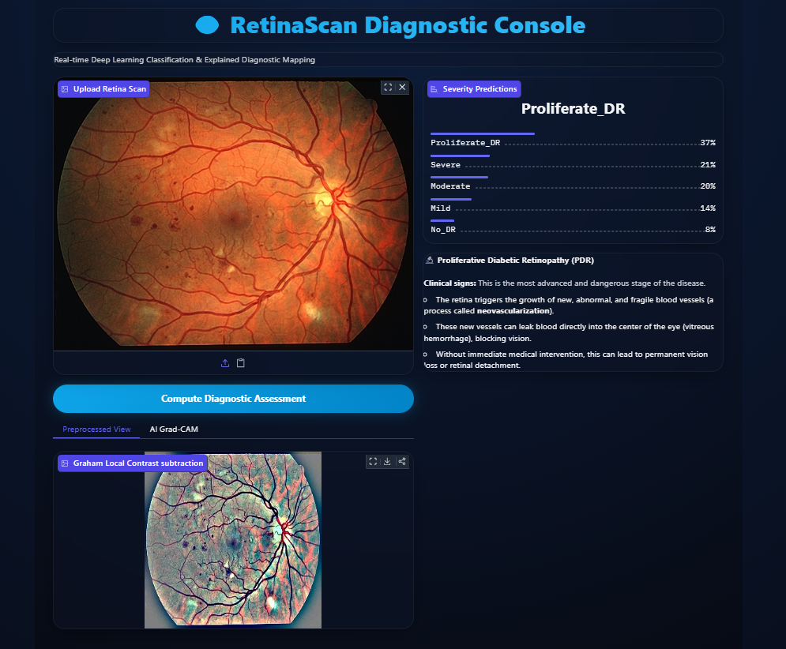
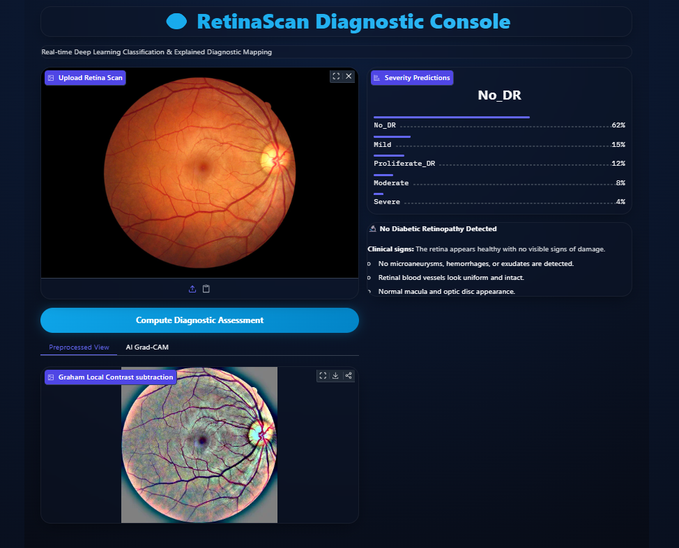

# 👁️ Diabetic Retinopathy Classification System

### 🌐 Live Web Demo: [Hugging Face Space](https://huggingface.co/spaces/venmugilrajan/Diabetic_Retinopathy)

An end-to-end deep learning pipeline to classify Diabetic Retinopathy severity from retinal fundus images, using PyTorch, EfficientNet-B3, Focal Loss, and a Next.js dashboard with a Gradio inference backend.



---

## 📖 About the Project

Diabetic Retinopathy (DR) is one of the leading causes of preventable blindness worldwide, caused by damage to retinal blood vessels from prolonged diabetes. Early-stage DR is frequently asymptomatic, and manual screening requires ophthalmologists to review high-resolution fundus photographs — a process that doesn't scale well in regions with a low specialist-to-patient ratio.

This project implements an **explainable, end-to-end diagnostic pipeline** that classifies fundus images into the five official DR severity levels, applies Grad-CAM to visually highlight the regions the model uses for its prediction, and serves results through a web dashboard — aiming to bridge the gap between raw model output and clinical interpretability.

---

## 🛠️ Built With

**Backend / ML**


**Frontend**


---

## 📁 Project Structure

```
├── src/                                  # Next.js App Router codebase
│   └── app/                              # Main pages, layouts, and API routes
├── diabetes-re/                          # Labeled Retina Dataset (ignored in Spaces)
│   ├── train.csv                         # Image names & diagnoses
│   └── colored_images/                   # Preprocessed image subfolders
├── code.ipynb                            # EDA, preprocessing, training & evaluation notebook
├── app.py                                # Gradio dashboard interface (Space app file)
├── best_diabetic_retinopathy_model.pth   # Saved model weights checkpoint
├── requirements.txt                      # Python dependencies
├── package.json                          # Next.js configuration and dependencies
├── next.config.js                        # Next.js bundler settings
└── README.md                             # Project documentation
```

---

## 🗂️ Dataset

The model is trained on the **Diabetic Retinopathy 224x224 (2019 Data)** dataset from Kaggle, containing labeled fundus photographs across 5 severity classes (No DR, Mild, Moderate, Severe, Proliferative DR).

🔗 [Kaggle Dataset — sovitrath/diabetic-retinopathy-224x224-2019-data](https://www.kaggle.com/datasets/sovitrath/diabetic-retinopathy-224x224-2019-data)

---

## 📊 Model Performance & Metrics

The model uses an **EfficientNet-B3** backbone fine-tuned on the dataset above. To address significant class imbalance (healthy cases far outnumber severe ones), training uses a **class-weighted Focal Loss**.

### 📈 Training Progress Summary
- **Final Epoch (Epoch 15)**
  - **Training Accuracy:** 72.87%
  - **Validation Accuracy:** 72.54%
  - **Validation Loss:** 0.2603

### 📋 Classification Report (Validation Set)

Overall **accuracy: 71%** across 5 classification levels.

| Diagnosis Class | Severity Level | Precision | Recall | F1-Score | Support |
| :--- | :--- | :---: | :---: | :---: | :---: |
| Class 0 | No DR | 0.97 | 0.93 | 0.95 | 364 |
| Class 1 | Mild NPDR | 0.34 | 0.62 | 0.44 | 58 |
| Class 2 | Moderate NPDR | 0.82 | 0.40 | 0.54 | 211 |
| Class 3 | Severe NPDR | 0.34 | 0.78 | 0.47 | 49 |
| Class 4 | Proliferative DR | 0.34 | 0.42 | 0.38 | 50 |
| **Macro Avg** | | 0.56 | 0.63 | 0.56 | 732 |
| **Weighted Avg** | | 0.79 | 0.71 | 0.72 | 732 |


---

## 🖼️ Results and Outputs

### Case 1: Proliferative Diabetic Retinopathy (PDR)
System output for a case diagnosed with Proliferative DR. The preprocessed view highlights dense microaneurysms and abnormal vessel networks:


### Case 2: Normal Retina (No DR)
System output for a healthy retina. The preprocessed view shows clear macular areas, uniform vessel maps, and no hemorrhages:



---

## ✨ Key Features

1. **Dual Theme Modes** — dark and light UI presets for the dashboard.
2. **Clinician Annotation Canvas** — real-time sketching overlay on the fundus photograph to mark lesion boundaries.
3. **Graham Preprocessing View** — Gaussian blur subtraction to sharpen vascular contrast, shown side-by-side with the original image.
4. **Grad-CAM Heatmapping** — visualizes the image regions the model weighted most heavily in its prediction, for interpretability.

---

## ⚠️ Limitations

- Validation performance on minority classes (Mild, Severe, Proliferative DR) is lower than on the majority "No DR" class, due to limited training samples per class.
- The model has not been clinically validated and is intended as a screening aid / hackathon prototype, not a diagnostic replacement for an ophthalmologist.
- Performance is dependent on image quality; no automated quality-check step is currently implemented for blurry or poorly lit fundus photos.

---

## 🛠️ Setup & Installation

### 1. Python ML Backend
```bash
pip install -r requirements.txt
python app.py
```
Open `http://127.0.0.1:7860` to access the local Gradio interface.

### 2. Next.js Web Dashboard
```bash
npm install
npm run dev
```
Open [http://localhost:3000](http://localhost:3000) in your browser.

---

## 🚀 Hosting & Deployment

### Hugging Face Spaces (Backend)
This directory is configured with Gradio Space frontmatter metadata. Push `app.py`, `requirements.txt`, and `best_diabetic_retinopathy_model.pth` to a Hugging Face Space to run the model continuously.

### Vercel (Next.js Frontend)
1. Push the repository to GitHub.
2. Link the repository to a new project in [Vercel](https://vercel.com/).
3. Vercel automatically builds and deploys the Next.js app at a public link.
4. Use the header settings icon (⚙️) on the deployed site to point the frontend at your Hugging Face Space path (e.g. `venmugilrajan/Diabetic_Retinopathy`).

---

## 🔮 Future Scope

1. **Lesion Segmentation** — add a U-Net head alongside the classifier for pixel-level segmentation of microaneurysms and hard exudates.
2. **Automated Patient Reports** — export clinical observations, annotations, and confidence scores as standardized PDF reports.
3. **EHR Integration** — connect the annotation database to hospital Electronic Health Record systems using FHIR standards.

---

## 👥 Team — The Pixels

| Name | Registration No. |
| :--- | :--- |
| Nishal A T | 7376241CS301 |
| Nitish Priyan R S | 7376241CS311 |
| Venmugil Rajan S | 7376241CS456 |

---

## 📄 License

This project is licensed under the **MIT License**.
